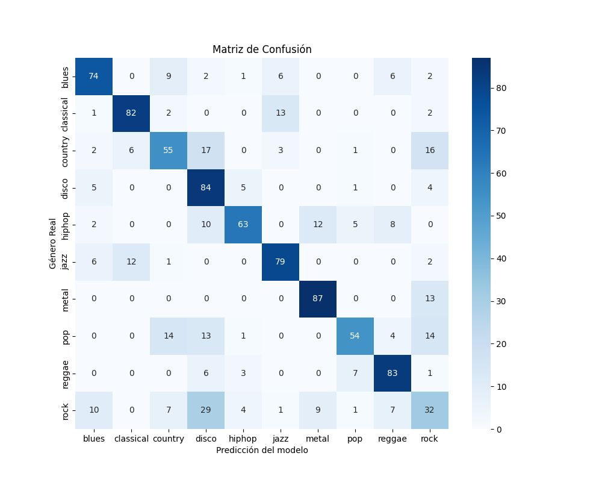
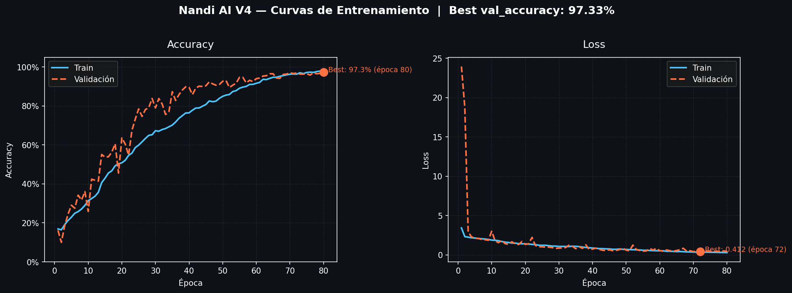

# 🎷 Nandi AI: Clasificación de Géneros Musicales en Vivo

**Nandi AI** es una plataforma de Inteligencia Artificial que procesa señales de audio para identificar géneros musicales mediante el análisis de **Espectrogramas de Mel** y **Redes Neuronales Convolucionales (CNN)**.

> *Proyecto desarrollado por **Joel Gimenez** como parte de la trayectoria en la **Licenciatura en Ciencias de Datos (UBA)**.*

---

## 🚀 Live Demo
[](TU_LINK_DE_STREAMLIT_AQUÍ)
*(Una vez desplegado en Streamlit Cloud, pegá el link aquí)*

---

## 🧠 Arquitectura Técnica

El sistema transforma el audio en una representación visual de frecuencia y tiempo para que una CNN pueda clasificarlo:

1. **Procesamiento de Audio** — Conversión de señales temporales a **Log-Mel Spectrograms** normalizados en `[0, 1]` (128 bandas mel × 130 frames, ventana de 3 segundos).
2. **Data Augmentation V4** — El dataset original GTZAN (100 muestras/género) se expande a ~600 muestras/género mediante 6 transformaciones: original, pitch shift, time stretch, ruido gaussiano, volumen aleatorio y crop aleatorio.
3. **Modelo CNN** — Arquitectura con 3 bloques convolucionales (`Conv2D → BatchNorm → MaxPool → Dropout`) + regularización L2, totalizando ~8.4M parámetros.
4. **Análisis por Segmentos** — La IA evalúa 3 fragmentos con offsets adaptativos según la duración real del audio y promedia las probabilidades para una predicción más robusta.
5. **Lógica de Incertidumbre** — Si la confianza es inferior al 60%, el sistema notifica una señal ambigua.

---

## 📈 Performance — Versión 4

| Métrica | V3 (anterior) | **V4 (actual)** |
|---|---|---|
| Val Accuracy | ~69% | **97.33%** |
| Overfitting | Alto | Mínimo (∆ < 0.5%) |
| Dataset size | 200/género | ~600/género |
| Normalización | ❌ Sin normalizar | ✅ Min-max [0,1] |

### Visualización del Entrenamiento
| Matriz de Confusión | Curvas de Aprendizaje |
|:---:|:---:|
|  |  |

---

## 🛠️ Tecnologías Utilizadas

| Categoría | Tecnología |
|---|---|
| Lenguaje | Python 3.10+ |
| Deep Learning | TensorFlow / Keras |
| Audio | Librosa, SoundFile |
| Fuentes de datos | Spotify API, yt-dlp |
| Interfaz Web | Streamlit |
| Visualización | Matplotlib, Seaborn |

---

## 💻 Instalación Local

```bash
# 1. Clonar repositorio
git clone https://github.com/TU_USUARIO/music_genre_classification.git
cd music_genre_classification

# 2. Instalar dependencias
pip install -r requirements.txt

# 3. Configurar credenciales de Spotify en .env
SPOTIPY_CLIENT_ID=tu_client_id
SPOTIPY_CLIENT_SECRET=tu_client_secret

# 4. Ejecutar la app
streamlit run app/app_nandi.py
```

### Regenerar el modelo desde cero

```bash
python src/augment_v4.py        # genera ~600 .wav por género
python src/create_split.py      # train / val / test splits
python src/extract_features.py  # genera espectrogramas .npy
python src/train_model.py       # entrena la CNN
```

---

## 📁 Estructura del Proyecto

```
music_genre_classification/
├── app/
│   └── app_nandi.py          # Interfaz Streamlit
├── datasets/
│   └── Data/
│       ├── genres_original/  # GTZAN original (100/género)
│       └── genres_v4/        # Dataset aumentado (~600/género)
├── models/
│   └── nandi_v4_final_best.h5
├── processed_data/           # Espectrogramas .npy normalizados
├── reports/                  # Historial de predicciones y métricas
├── src/
│   ├── augment_v4.py
│   ├── create_split.py
│   ├── extract_features.py
│   ├── nandi_utils.py        # Motor de procesamiento de audio
│   ├── nandi_history.py
│   ├── spotify_recommend.py
│   └── train_model.py
├── predict_nandi.py          # Predictor CLI
├── requirements.txt
└── README.md
```

---

**Contacto:** [LinkedIn](https://www.linkedin.com/in/joelgimenez/) | [Email](mailto:joelgimenezl72@gmail.com)