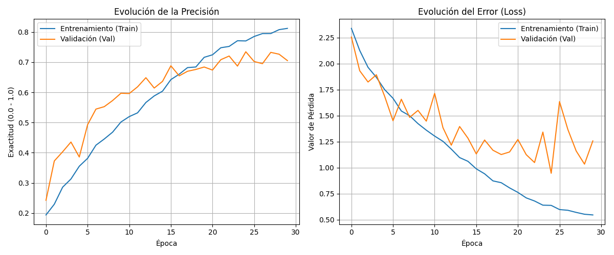

# 🎵 Nandi AI: Clasificador de Géneros Musicales

Nandi AI es un sistema basado en **Deep Learning** capaz de identificar géneros musicales analizando el espectrograma de frecuencia de archivos de audio. 

## 📈 Performance
* **Precisión en Test:** 69.40%
* **Modelo:** CNN (Red Neuronal Convolucional) optimizada con Dropout y Batch Normalization.
* **Dataset:** GTZAN (1000 muestras, 10 géneros).

## 📊 Visualización de Resultados
### Matriz de Confusión

*El modelo presenta una excelente performance en **Metal (87%)** y **Música Clásica (82%)**.*

### Historial de Entrenamiento

## 🛠️ Instalación y Uso
1. Instala las dependencias: `pip install -r requirements.txt`
2. Ejecuta el sistema: `python main.py`

## 🔗 Próximos Pasos
- [ ] Integración con Spotify API para recomendaciones basadas en el género detectado.
- [ ] Implementación de Data Augmentation para superar el 75% de precisión.
- [ ] Interfaz web con Streamlit.